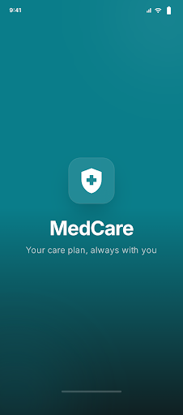
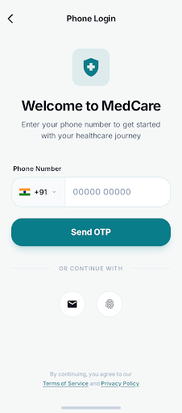
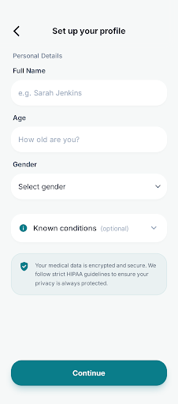
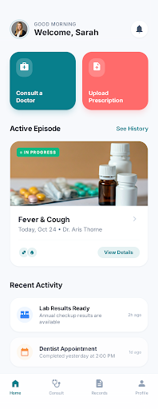
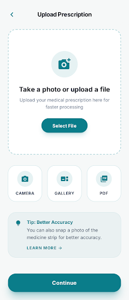
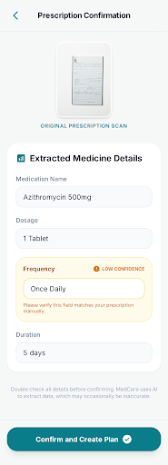
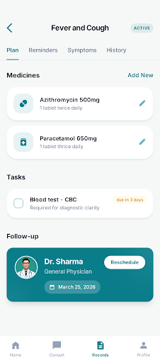
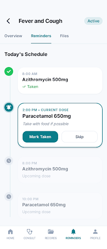
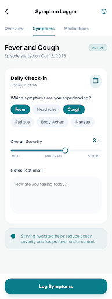
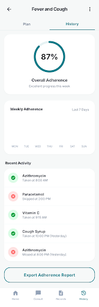

# MedCare — Smart Health Companion App

<div align="center">



**Turn any prescription into a structured, trackable care plan — powered by AI.**

[]()
[-blue)]()
[]()

</div>

---

## 🩺 What is MedCare?

MedCare is a mobile health companion that converts physical prescriptions and hospital discharge summaries into structured, actionable care plans with automated medication reminders. It uses **GPT-4 Vision** for intelligent OCR extraction and **Google Stitch MCP** for pharmaceutical database verification.

### The Two-Door Concept

| Door A — Consult a Doctor | Door B — Upload Prescription |
|---|---|
| For users who need to see a doctor first | For users who already have a plan |
| *Phase 3 feature* | **v1 primary focus** |

---

## ✨ Key Features (v1)

- 📸 **AI Prescription Scanner** — Snap a photo, get a structured care plan
- ⚠️ **Safety-First Confirmation** — Amber warnings on low-confidence AI fields
- ⏰ **Smart Reminders** — Actionable push notifications (Taken / Skip / Snooze)
- 👨‍👩‍👧 **Family Profiles** — Manage medications for parents, children, and self
- 📊 **Adherence Tracking** — Daily/weekly charts with PDF export
- 🔒 **Privacy by Design** — AES-256 encryption, DPDP Act compliant

---

## 📱 App Screens

<table>
<tr>
<td align="center"><strong>Splash</strong><br></td>
<td align="center"><strong>Login</strong><br></td>
<td align="center"><strong>OTP</strong><br></td>
<td align="center"><strong>Profile</strong><br></td>
</tr>
<tr>
<td align="center"><strong>Home</strong><br></td>
<td align="center"><strong>Upload</strong><br></td>
<td align="center"><strong>Confirm</strong><br></td>
<td align="center"><strong>Plan</strong><br></td>
</tr>
<tr>
<td align="center"><strong>Reminders</strong><br></td>
<td align="center"><strong>Symptoms</strong><br></td>
<td align="center"><strong>History</strong><br></td>
<td></td>
</tr>
</table>

---

## 🏗️ Architecture

```
Mobile Client (SwiftUI)
    ↓ HTTPS/TLS 1.3
API Gateway + Core REST API (Node.js)
    ↓                    ↓
PostgreSQL         GPT-4 Vision API
    ↓                    ↓
AWS S3           Stitch MCP Server
(Encrypted)      (Pharma DB Validation)
```

> For the full architecture diagram, see [HLD](docs/architecture/hld_medcare.md).

---

## 📂 Repository Structure

```
Healthcare-project/
├── README.md
├── CONTRIBUTING.md
├── LICENSE
├── .gitignore
│
├── docs/
│   ├── product/                    # What & Why
│   │   ├── prd_medcare.md          # Product Requirements
│   │   ├── trd_medcare.md          # Technical Requirements
│   │   ├── product_creation_plan.md # 12-Sprint Execution Plan
│   │   ├── MedCare_PRD_TechSpec.txt # Original specification
│   │   └── MedCare_PRD_TechSpec.docx
│   │
│   ├── architecture/               # How It Connects
│   │   ├── hld_medcare.md          # High-Level Design
│   │   ├── lld_medcare.md          # Low-Level Design (schemas, APIs)
│   │   └── project_understanding.md
│   │
│   └── design/                     # How It Looks
│       ├── app_design_spec.md      # Screen inventory & flows
│       ├── ui_mockups.md           # Mockup reference
│       └── screens/                # 11 Stitch-generated PNGs
│
├── ios/                            # (Sprint 1) SwiftUI app
├── backend/                        # (Sprint 1) Node.js API
└── .agent/workflows/               # Dev workflows
```

---

## 🗺️ Roadmap

| Phase | Timeline | Milestone |
|---|---|---|
| **v1 — Core** | Months 1-3 | Upload → AI Extract → Confirm → Plan → Reminders |
| **v2 — Wearables** | Months 4-6 | HealthKit / Health Connect integration |
| **v3 — Teleconsult** | Months 7-12 | In-app doctor consultations + payments |

---

## 🛠️ Tech Stack

| Layer | Technology |
|---|---|
| **iOS Frontend** | SwiftUI · iOS 16+ · SwiftData |
| **Backend API** | Node.js · Express · JWT Auth |
| **Database** | PostgreSQL 15+ |
| **File Storage** | AWS S3 (SSE-S3 encrypted) |
| **AI Extraction** | GPT-4 Vision API |
| **Integration** | Google Stitch MCP Server |
| **Push Notifications** | Firebase Cloud Messaging |
| **Job Queue** | Redis + BullMQ |
| **CI/CD** | GitHub Actions + Fastlane |

---

## 📖 Documentation

| Document | Description |
|---|---|
| [Product Requirements (PRD)](docs/product/prd_medcare.md) | Features, personas, monetization |
| [Technical Requirements (TRD)](docs/product/trd_medcare.md) | Stack, security, compliance |
| [High-Level Design (HLD)](docs/architecture/hld_medcare.md) | System architecture & data flows |
| [Low-Level Design (LLD)](docs/architecture/lld_medcare.md) | Database schemas, API contracts, Swift MVVM |
| [Product Creation Plan](docs/product/product_creation_plan.md) | 12-sprint execution roadmap |
| [App Design Spec](docs/design/app_design_spec.md) | Complete screen inventory |

---

## ⚠️ Safety & Compliance

- **AI is extraction only** — never diagnosis or prescription
- **Human-in-the-loop** — all AI output requires explicit user confirmation
- **DPDP Act (India, 2023)** compliant — right to data deletion, PII scrubbing
- **Encrypted everywhere** — AES-256 at rest, TLS 1.3 in transit

---

## 📄 License

This project is proprietary software. All rights reserved. See [LICENSE](LICENSE) for details.
