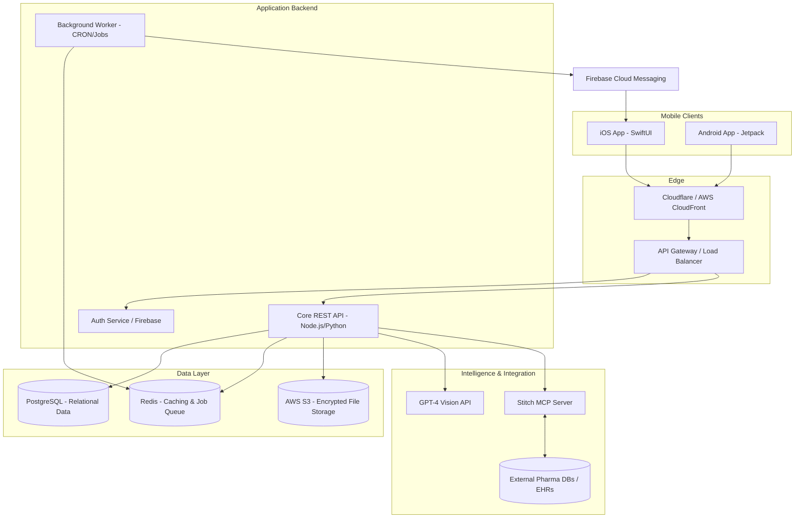

# MedCare: High-Level Design (HLD)

## 1. Introduction
This document outlines the High-Level Design (HLD) for **MedCare**, a smart health companion app. MedCare converts physical medical prescriptions and discharge summaries into structured, actionable, and trackable care plans with automated reminders. 

The architecture is designed to support a phased rollout:
- **Phase 1 (MVP)**: OCR/AI-driven prescription parsing and local adherence tracking.
- **Phase 2**: Wearable integration (Apple HealthKit / Google Health Connect).
- **Phase 3**: Telemedicine and in-app consultations.

## 2. System Architecture Overview
MedCare utilizes a modern, mobile-first cloud architecture built for the Indian market (English-only). It is designed to be highly secure (DPDP Act 2023 compliant), scalable, and resilient — with specific optimizations for Indian network conditions (2G/3G tolerance, image compression, low-bandwidth mode).

### 2.1 Core Subsystems
The system is divided into four primary subsystems:
1.  **Mobile Client (iOS/Android)**: The user-facing application built natively (SwiftUI) or cross-platform (React Native/Flutter). It handles UI/UX, local adherence caching, push notification rendering, and device health integration.
2.  **API Gateway & Application Backend**: A RESTful (or GraphQL) Node.js/FastAPI monolithic service. It manages business logic, user profiles, episode management, and scheduling.
3.  **AI Extraction & Integration Middleware (Stitch MCP)**: The intelligence layer. It orchestrates sending raw images to LLMs (GPT-4 Vision) for parsing, and then uses the **Stitch MCP Server** to validate extracted medicines against external pharmaceutical databases, ensuring high accuracy.
4.  **Data & Persistence Layer**: A managed PostgreSQL database for structured relational data, coupled with AWS S3 for secure, encrypted medical document storage.

## 3. Architecture Diagram

## 4. Key Data Flows

### 4.1 Onboarding & Authentication Flow
1. User enters phone number on the Mobile Client.
2. Client calls `/auth/send-otp`. Backend triggers an SMS via Twilio/MSG91.
3. User enters OTP. Client calls `/auth/verify-otp`.
4. Backend verifies OTP, generates a JWT session token, creates a `User` and default `Profile` record in PostgreSQL.
5. Client securely stores the JWT in the Keychain/Keystore.

### 4.2 Dual-Capture Upload & Extraction Flow (The "Magic" Loop)
MedCare uses a **dual-capture approach** optimized for Indian prescriptions: the user uploads both the prescription (handwritten context) and photos of the physical medicine packaging (printed, reliable source of truth for drug names and dosages).

**Step 1 — Capture (Client-Side):**
1. User captures a prescription photo (Camera, Gallery, or PDF).
2. App prompts user to photograph each medicine box/strip/bottle purchased from the pharmacy (1-10 photos). This is the **primary extraction source**.
3. Client requests pre-signed S3 upload URLs from the Core API (one per image).
4. Client compresses images (target: < 500KB each for bandwidth efficiency on Indian networks) and uploads directly to AWS S3.

**Step 2 — AI Extraction (Server-Side):**
5. Client calls `POST /episodes/:id/upload` with S3 keys categorized as `{ prescriptionKeys: [...], medicinePhotoKeys: [...] }`.
6. **Medicine Packaging Extraction**: Core API sends medicine photos to GPT-4 Vision. Extracts: brand name, generic/salt composition, strength, dosage form, manufacturer, MRP, expiry date, batch number. High confidence due to standardized printed text.
7. **Prescription Context Extraction**: Core API sends prescription photo to GPT-4 Vision. Extracts: doctor name, diagnosis/condition, frequency (BD/TDS/etc.), duration, timing instructions (before/after food), follow-up date.
8. **Cross-Reference**: Backend merges both extractions — matching prescription line items to physical medicine packaging. Assigns per-field confidence scores (packaging-sourced fields score higher).
9. **Validation**: Merged JSON is passed through the **Stitch MCP Server** for pharma database validation (spelling correction, dosage verification).
10. Core API returns the validated, cross-referenced JSON to the client. **Nothing is persisted yet.**

**Step 3 — Confirmation (Client-Side, Safety-Critical):**
11. Client displays the "Confirmation Screen" with all uploaded images alongside extracted data.
12. Fields sourced from packaging show a "Verified from packaging" badge. Fields from handwriting with `confidence_score < 0.70` are highlighted in amber.
13. User verifies, edits if needed, and calls `POST /episodes/:id/confirm`.
14. Core API creates `Medicine`, `Task`, and `DoseLog` records in PostgreSQL.

## 5. Security & Compliance Strategy
- **Encryption in Transit**: All API communication strictly enforces TLS 1.3 / HTTPS.
- **Encryption at Rest**: PostgreSQL database uses AES-256 block-level encryption. S3 buckets are configured with SSE-S3 or SSE-KMS.
- **Data Segregation**: Medical images in S3 are inaccessible via public URLs; they require short-lived pre-signed URLs authenticated via the Core API.
- **AI Safety**: The architecture strictly enforces a "human-in-the-loop" constraint. The AI pipeline *never* writes directly to the database without the explicit user confirmation API call.

## 6. Scalability Considerations
- The Core API is stateless (auth via JWT), allowing horizontal pod autoscaling (HPA) in Kubernetes.
- Database read replicas can be introduced when read-heavy operations (like retrieving historical adherence logs) bottleneck the primary instance.
- The AI Extraction pipeline (the slowest operation) is decoupled asynchronously where possible, using a polling or WebSocket mechanism for the client to receive the result without holding the HTTP connection open.
