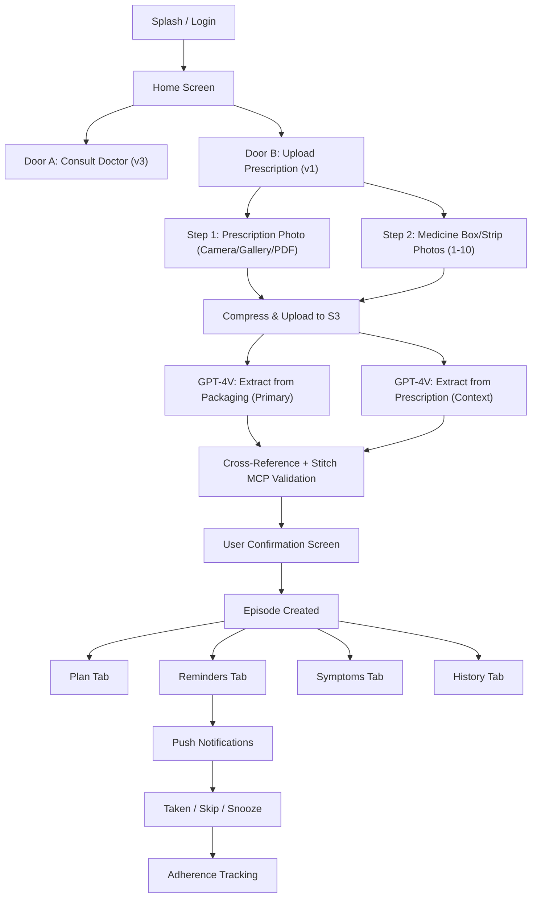

# MedCare — Project Understanding

> **One app, two entry doors.** Turn any prescription or discharge summary into a structured, trackable care plan with automated reminders.

**Market:** India-first, English-only. Built for Indian prescription formats and pharmacy workflows.

## Architecture at a Glance

## v1 Core Loop

| Step | What Happens |
|------|-------------|
| **Capture — Prescription** | User uploads the doctor's prescription (Camera, Gallery, or PDF). This provides context: doctor name, diagnosis, frequency, duration, timing instructions. |
| **Capture — Medicines** | User photographs each medicine box/strip/bottle purchased from the pharmacy (1-10 photos). This is the **primary source of truth** — Indian medicine packaging has standardized printed text (brand name, generic name, strength, manufacturer, MRP, expiry) mandated by CDSCO. Far more reliable than handwritten prescriptions. |
| **Extract & Cross-Reference** | Backend sends all images to GPT-4 Vision. Medicine packaging photos yield high-confidence drug data. Prescription photo yields frequency/duration context. Backend cross-references both, then validates via **Stitch MCP Server** against pharma databases. Each field gets a confidence score and source attribution (packaging vs prescription). |
| **Confirm** | User reviews extraction with source badges ("From packaging" / "From prescription"). Amber warnings on low-confidence fields. Unmatched prescription items prompt manual entry. User must explicitly confirm each medicine. |
| **Plan** | Episode + Medicines + Tasks created from confirmed data |
| **Remind** | Push notifications fire at scheduled dose times with actionable buttons |
| **Track** | Adherence %, symptom logs, history, and exportable PDF reports |

## Key Safety Rules

> [!CAUTION]
> - **Never auto-confirm** AI-extracted data — always require explicit user confirmation
> - **Never present** AI output as medical advice or a recommendation
> - **Always show** a disclaimer: *"This app does not provide medical advice"*
> - Confirmation is a **separate API call** (`POST /episodes/:id/confirm`) to make bypassing impossible

## Monetisation Summary

| | Free | Pro (₹29–49/mo) |
|---|------|------------------|
| Episodes | 1 active | Unlimited |
| Profiles | Self only | Up to 5 family |
| Prescription upload | ❌ | ✅ + AI extraction |
| History | 7 days | Full + PDF export |

## Phase Roadmap

| Phase | Timeline | Scope |
|-------|----------|-------|
| **v1 Core** | Month 1–3 | Upload → extract → plan → reminders |
| **v2 Wearables** | Month 4–6 | HealthKit, passive tracking, trends |
| **v3 Teleconsult** | Month 7–12 | In-app doctors, RMP verification, payments |
