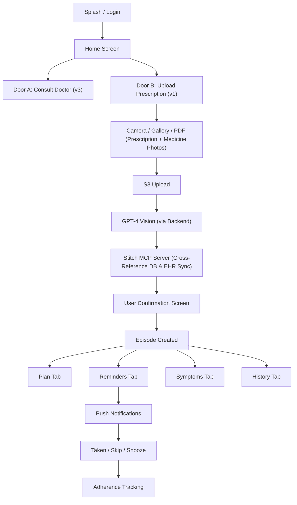

# MedCare — Project Understanding

> **One app, two entry doors.** Turn any prescription or discharge summary into a structured, trackable care plan with automated reminders.

## Architecture at a Glance

## v1 Core Loop

| Step | What Happens |
|------|-------------|
| **Capture** | User uploads a prescription photo, gallery image, or PDF (up to 10 pages). *Crucially*, they can also optionally upload photos of physical medicine packaging to help the AI cross-reference messy handwriting. |
| **Extract & Stitch** | Backend sends all images to GPT-4 Vision. AI cross-references the text. The backend then queries the **Stitch MCP Server** to validate extracted medicines against external databases and push records to connected EMRs/EHRs. |
| **Confirm** | User reviews extraction side-by-side with original image, edits any errors, confirms each medicine |
| **Plan** | Episode + Medicines + Tasks created from confirmed data |
| **Remind** | Push notifications fire at scheduled dose times with actionable buttons |
| **Track** | Adherence %, symptom logs, history, and exportable PDF reports |

## Key Safety Rules

> [!CAUTION]
> - **Never auto-confirm** AI-extracted data — always require explicit user confirmation
> - **Never present** AI output as medical advice or a recommendation
> - **Always show** a disclaimer: *"This app does not provide medical advice"*
> - Confirmation is a **separate API call** (`POST /episodes/:id/confirm`) to make bypassing impossible

## Monetisation Summary

| | Free | Pro (₹29–49/mo) |
|---|------|------------------|
| Episodes | 1 active | Unlimited |
| Profiles | Self only | Up to 5 family |
| Prescription upload | ❌ | ✅ + AI extraction |
| History | 7 days | Full + PDF export |

## Phase Roadmap

| Phase | Timeline | Scope |
|-------|----------|-------|
| **v1 Core** | Month 1–3 | Upload → extract → plan → reminders |
| **v2 Wearables** | Month 4–6 | HealthKit, passive tracking, trends |
| **v3 Teleconsult** | Month 7–12 | In-app doctors, RMP verification, payments |
