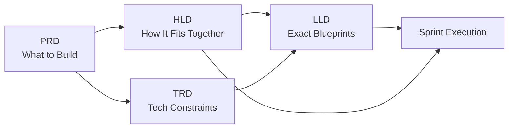
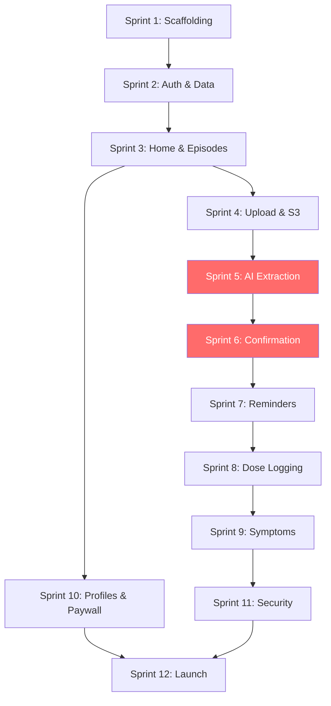

# MedCare: Unified Product Creation Plan

This document synthesizes the [PRD](file:///Users/modi/.gemini/antigravity/brain/5704d3f7-5d11-421c-bf15-e327bd036062/prd_medcare.md), [TRD](file:///Users/modi/.gemini/antigravity/brain/5704d3f7-5d11-421c-bf15-e327bd036062/trd_medcare.md), [HLD](file:///Users/modi/.gemini/antigravity/brain/5704d3f7-5d11-421c-bf15-e327bd036062/hld_medcare.md), and [LLD](file:///Users/modi/.gemini/antigravity/brain/5704d3f7-5d11-421c-bf15-e327bd036062/lld_medcare.md) into a single, clean execution roadmap. It identifies gaps, resolves ambiguities, and lays out a sprint-by-sprint path from zero to App Store submission.

---

## 1. Cross-Document Audit

Before building, I reviewed all four documents for consistency. Here is a summary of findings and resolutions.

| Area | Finding | Resolution |
|---|---|---|
| **Database schema** | LLD is missing `tasks` and `symptom_logs` tables defined in the original PRD | Add both tables in Sprint 2 migration |
| **Episode fields** | LLD `episodes` table lacks `source`, `doctor_name`, `follow_up_date` columns present in PRD | Add missing columns to schema |
| **API naming** | HLD uses `/upload`, TRD uses `/extract` for the same endpoint | Standardize: `POST /episodes/:id/upload` triggers extraction |
| **Confirmation API** | All docs agree on `POST /episodes/:id/confirm` as the HITL gate | ✅ Consistent |
| **Offline support** | PRD & TRD both require offline dose logging; LLD describes SwiftData cache | ✅ Consistent |
| **Stitch MCP role** | HLD/TRD describe Stitch as pharma DB validator; PRD omits Stitch | PRD is the product view; Stitch is an implementation detail. No change needed. |
| **Token lifecycle** | TRD specifies 15m access / 30d refresh; LLD does not mention | LLD will inherit TRD spec |

> [!IMPORTANT]
> The LLD database schema needs two additional tables (`tasks`, `symptom_logs`) and three columns on `episodes` before it matches the PRD. These are addressed in Sprint 2 below.

---

## 2. Document Relationship Map

- **PRD** answers *what* and *why* (features, personas, monetization).
- **TRD** answers *with what* (stack, security, compliance constraints).
- **HLD** answers *how it connects* (system architecture, data flows).
- **LLD** answers *how to build it* (schemas, API contracts, Swift components).

---

## 3. Phased Sprint Plan (12 Weeks to v1 Launch)

### Phase A: Foundation (Weeks 1-3)

#### Sprint 1 — Project Scaffolding & Design System
| Item | Details |
|---|---|
| **iOS** | Create Xcode project (SwiftUI, iOS 16+). Set up folder structure: `/Models`, `/Views`, `/ViewModels`, `/Repositories`, `/Services`. |
| **Backend** | Initialize Node.js + Express project. Configure ESLint, Prettier, Docker Compose for local dev (Postgres + Redis). |
| **Database** | Write migration `001_initial_schema.sql`: `users`, `profiles` tables per LLD. |
| **Design** | Implement the design system in SwiftUI: color tokens (`#0A7E8C`, `#FF6B6B`, `#F7F9FC`), typography (Inter font), spacing scale. |
| **Infra** | Set up GitHub repo, CI/CD with GitHub Actions, Fastlane for TestFlight. |
| ✅ **Done when** | Empty app compiles, backend serves `/health`, database migrates cleanly. |

#### Sprint 2 — Auth & Core Data Layer
| Item | Details |
|---|---|
| **Auth** | Implement OTP flow: `POST /auth/send-otp`, `POST /auth/verify-otp`. Integrate Twilio/MSG91. JWT access (15m) + refresh (30d) tokens per TRD. |
| **iOS Auth** | Build `SplashView`, `PhoneEntryView`, `OTPVerificationView`. Store JWT in Keychain. |
| **Database** | Migration `002_episodes_medicines.sql`: `episodes` (with `source`, `doctor_name`, `follow_up_date`), `medicines`, `dose_logs`, `tasks`, `symptom_logs`. |
| **Profile** | `POST /profiles`, `GET /profiles`. iOS `ProfileSetupView` with name, age, gender. |
| ✅ **Done when** | User can sign up via OTP, create a profile, and see an empty Home Screen. |

#### Sprint 3 — Home Dashboard & Episode Shell
| Item | Details |
|---|---|
| **iOS** | Build `HomeView` with two CTAs per Stitch mockup. Bottom tab bar (Home, Episodes, Records, Profile). |
| **Episodes API** | `GET /episodes`, `POST /episodes` (manual creation), `GET /episodes/:id`. |
| **iOS Episodes** | `EpisodeListView`, `EpisodeDetailView` with 4-tab skeleton (Plan, Reminders, Symptoms, History). |
| ✅ **Done when** | User can manually create an episode titled "Fever" and see it on the home screen. |

---

### Phase B: The "Magic" Loop (Weeks 4-6)

#### Sprint 4 — Prescription Upload & S3
| Item | Details |
|---|---|
| **Backend** | `GET /episodes/:id/upload-url` returns a pre-signed S3 PUT URL. Configure S3 bucket with SSE-S3 encryption, private ACLs, and `aws:SecureTransport` policy per TRD. |
| **iOS** | Build `CaptureView`: Camera, Gallery picker, PDF import. Optional medicine-photo prompt. Upload binary directly to S3 via pre-signed URL. |
| ✅ **Done when** | User can photograph a prescription and it appears encrypted in S3. |

#### Sprint 5 — AI Extraction Pipeline (GPT-4V + Stitch)
| Item | Details |
|---|---|
| **Backend** | `POST /episodes/:id/upload` triggers: (1) Fetch image from S3, (2) Send to GPT-4 Vision with structured prompt enforcing JSON schema + confidence scores, (3) Pipe result through Stitch MCP for pharma DB validation, (4) Return transient JSON to client. |
| **Safety** | The API must **never** write to `medicines` table at this step. This is a hard architectural constraint from all four documents. |
| **iOS** | Build `ConfirmationView` per Stitch mockup: side-by-side prescription image + extracted cards. Amber warning on fields with `confidenceScore < 0.70`. |
| ✅ **Done when** | User uploads a prescription photo, sees extracted medicine data with confidence indicators. |

#### Sprint 6 — Confirmation & Plan Activation
| Item | Details |
|---|---|
| **Backend** | `POST /episodes/:id/confirm` accepts the user-curated `confirmedMedicines[]` array. Creates `Medicine` rows, generates 30-day `DoseLog` projections, creates `Task` rows from extracted non-medicine items. |
| **iOS** | `ConfirmationViewModel` validates all medicines are explicitly confirmed. Enable CTA only when complete. Navigate to `EpisodeDetailView` (Plan tab) on success. |
| **Disclaimer** | Medical disclaimer text visible on Confirmation screen per PRD Section 6. |
| ✅ **Done when** | Full "Upload → Extract → Confirm → Plan Created" loop works end-to-end. |

---

### Phase C: Adherence Engine (Weeks 7-9)

#### Sprint 7 — Reminders & Push Notifications
| Item | Details |
|---|---|
| **Backend** | On plan confirmation, schedule BullMQ/Redis jobs for each `DoseLog`. Jobs fire FCM push 5 minutes before `scheduled_at`. Payload includes medicine name, dose, and action buttons (Taken, Snooze, Skip). |
| **iOS** | Register for FCM. Handle actionable notifications. Build `RemindersTabView` showing today's timeline. |
| ✅ **Done when** | User receives a push notification at the correct time and can tap "Taken" from the lock screen. |

#### Sprint 8 — Dose Logging & Offline Sync
| Item | Details |
|---|---|
| **Backend** | `POST /doses/:id/log` accepts `{ status: "taken" | "skipped" | "out_of_stock" }`. |
| **iOS** | `DoseLogRepository` writes to local SwiftData first, then syncs to backend. `OfflineSyncManager` queues failed requests and retries on connectivity restoration. |
| **Adherence API** | `GET /episodes/:id/adherence` returns `{ adherencePercent, takenCount, skippedCount, totalScheduled }`. |
| ✅ **Done when** | User can log doses offline; data syncs when back online. Adherence % is accurate. |

#### Sprint 9 — Symptoms & History
| Item | Details |
|---|---|
| **Backend** | `POST /symptoms` logs daily check-in. `GET /episodes/:id/history` returns adherence + symptom timeline. |
| **iOS** | `SymptomsTabView` with daily check-in card, severity slider (1-5), free text. `HistoryTabView` with adherence chart and exportable PDF. |
| ✅ **Done when** | User can log symptoms, view adherence trends, and export a PDF report. |

---

### Phase D: Polish & Launch (Weeks 10-12)

#### Sprint 10 — Multi-Profile & Monetization
| Item | Details |
|---|---|
| **Profiles** | Profile switcher on Home screen. CRUD for family profiles. Backend enforces Free tier limits (1 profile, 1 episode, no AI upload). |
| **Paywall** | Contextual upgrade prompts per PRD. Integrate RevenueCat or StoreKit 2 for subscription management. |
| ✅ **Done when** | Free user hits limit → sees upgrade prompt. Pro user has full access. |

#### Sprint 11 — Security Hardening & Compliance
| Item | Details |
|---|---|
| **SSL Pinning** | Implement certificate pinning in the iOS networking layer per TRD. |
| **Data Deletion** | `DELETE /user` cascading delete of all data + S3 objects per DPDP Act. |
| **Analytics** | Integrate Mixpanel/Amplitude with PII scrubbing at the gateway layer per TRD. |
| ✅ **Done when** | Penetration test passes. User can delete account and all data is purged. |

#### Sprint 12 — QA, Beta & App Store Submission
| Item | Details |
|---|---|
| **QA** | Full regression testing across all flows. Edge cases: expired JWT, no internet, massive prescription (10 pages), low-confidence on every field. |
| **Beta** | TestFlight distribution to 20-50 beta testers. Collect feedback via in-app form. |
| **Submission** | App Store review prep: privacy nutrition labels, medical disclaimer, screenshots. |
| ✅ **Done when** | App is live on the App Store. |

---

## 4. Dependency Graph

> [!TIP]
> **Critical Path** (highlighted in red): Sprints 5 and 6 (AI Extraction + Confirmation) are the highest-risk, highest-value sprints. They contain the core "magic" of the product and the critical safety gate. Allocate extra time and testing here.

---

## 5. Risk Register

| # | Risk | Impact | Mitigation |
|---|---|---|---|
| 1 | GPT-4V hallucinating wrong medicine names | **Critical** — Patient safety | Stitch MCP pharma DB validation + mandatory user confirmation (HITL) |
| 2 | Handwritten prescriptions unreadable by OCR | High — Poor user experience | Optional medicine-photo feature to cross-reference. Fallback to manual entry. |
| 3 | Push notification delivery unreliable | High — Core value broken | Use FCM high-priority channel. Local iOS `UNNotificationRequest` as fallback. |
| 4 | App Store rejection for medical claims | Medium — Launch delay | Strict disclaimer language. AI is "extraction only", never "diagnosis". |
| 5 | S3 pre-signed URL expiry during slow upload | Low — UX friction | Set URL expiry to 15 minutes. Retry logic in `EpisodeRepository`. |

---

## 6. Success Metrics (v1 Launch)

| Metric | Target | Measured By |
|---|---|---|
| Onboarding completion rate | > 80% | Analytics funnel |
| AI extraction accuracy (post-Stitch) | > 90% field-level | Backend logging |
| Daily reminder response rate | > 60% | DoseLog status != pending |
| 7-day retention | > 40% | Analytics cohort |
| Pro conversion (Month 3) | > 5% of MAU | RevenueCat dashboard |
| App crash rate | < 1% | Firebase Crashlytics |
